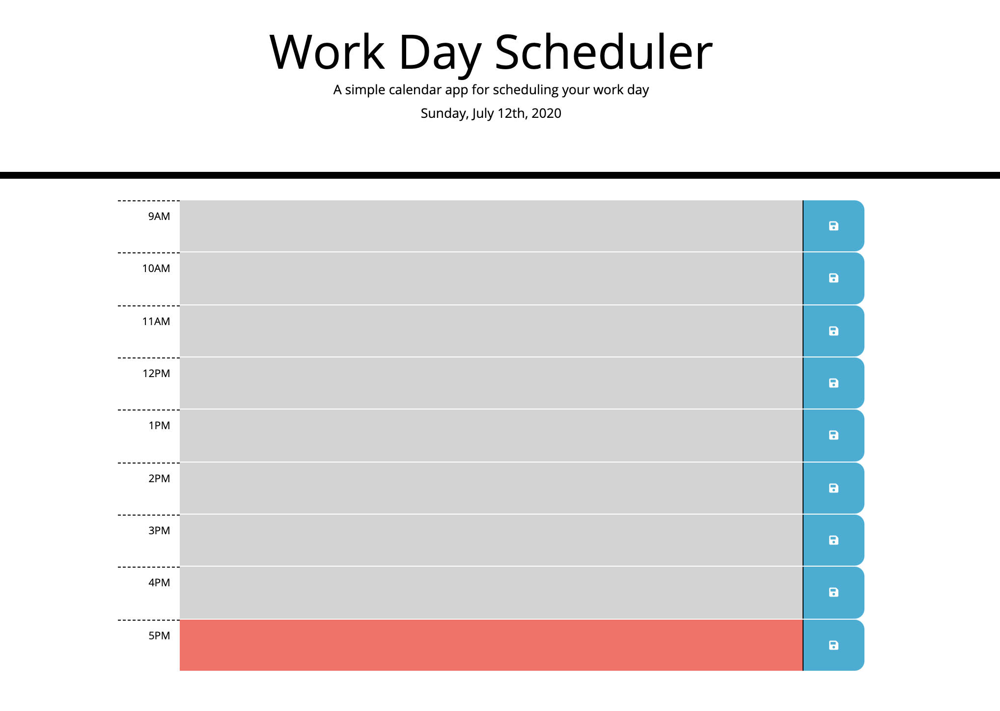

# HW5-Work-Day-Planner

## Description

A daily planner which allows you to write a task in a specific time slot and save it to retrieve the task even when the page is reloaded. It is set out in hourly blocks from 9am to 5pm.

It is colour-coded according to the time of day to easily track what tasks are past and upcoming (i.e. grey for past events, red for the current event and green for upcoming events).

## Usage

## Try Plan Your Day!

https://acho9138.github.io/HW5-Work-Day-Planner/

## Credits

Thank you to the following resources to help make this day planner possible:

- The Coding Bootcamp at University of Sydney
- Moment.js
- MDN
- Stack Overflow
- w3schools.com
- Bootstrap
- jQuery